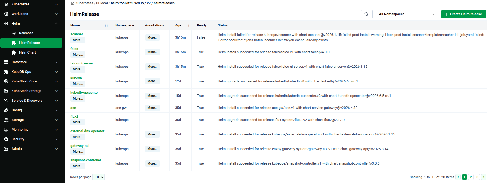
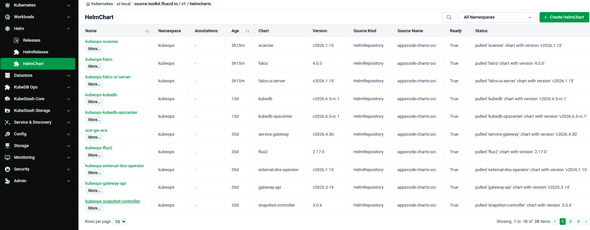

# Helm Chart Management

The **Helm** group in the Cluster UI sidebar lets you view and manage the Helm resources deployed in your cluster. It surfaces two types of FluxCD resources — Releases and HelmCharts — so you can see what is installed, check its status, and create new resources directly from the UI.

## Open the Helm Section

1. Navigate to the [Platform Console](https://console.appscode.com).
2. Click on your imported cluster to open its Cluster Overview page.
3. In the left sidebar, click **Helm** to expand it.

---

## Releases

A HelmRelease is a FluxCD resource that describes a deployed Helm chart in the cluster. The Platform Console tracks every HelmRelease and shows its current reconciliation state, so you can instantly see whether an installation or upgrade succeeded or is still in progress.

Use this page to verify that a chart was installed correctly, check for failed releases, or create a new HelmRelease without using the command line.

Lists every HelmRelease with its **Namespace**, **Age**, **Ready** status, and a **Status** message showing the last Helm operation result. Click **+ Create HelmRelease** to define a new release from the UI.

---

## Helm Charts

A HelmChart is a FluxCD resource that sources a specific chart and version from a HelmRepository. Each HelmRelease references a HelmChart behind the scenes. Viewing this page tells you which charts are being pulled, from where, and whether the source is reachable and up to date.

Use this page to check chart versions in use, verify that chart sources are resolving correctly, or create a new HelmChart resource.

Lists every HelmChart with its **Namespace**, **Annotations**, **Age**, **Chart** name, **Version**, **Source Kind**, **Source Name**, **Ready** state, and **Status**. Click **+ Create HelmChart** to add a new chart source.

---

## Quick Reference

| Task | How to do it |
|---|---|
| Open the Helm view | Click your cluster → click **Helm** in the left sidebar |
| Check release status | Click **Releases** under the Helm group |
| View chart sources | Click **Helm Charts** under the Helm group |
| Create a new release | Click **+ Create HelmRelease** on the Releases page |
| Create a new chart source | Click **+ Create HelmChart** on the Helm Charts page |
