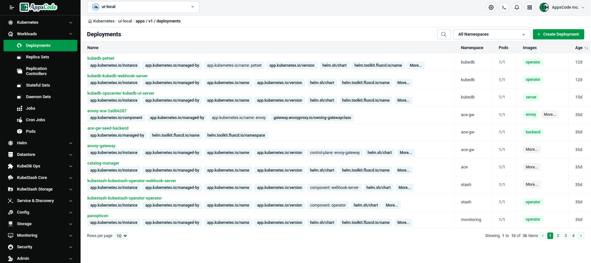
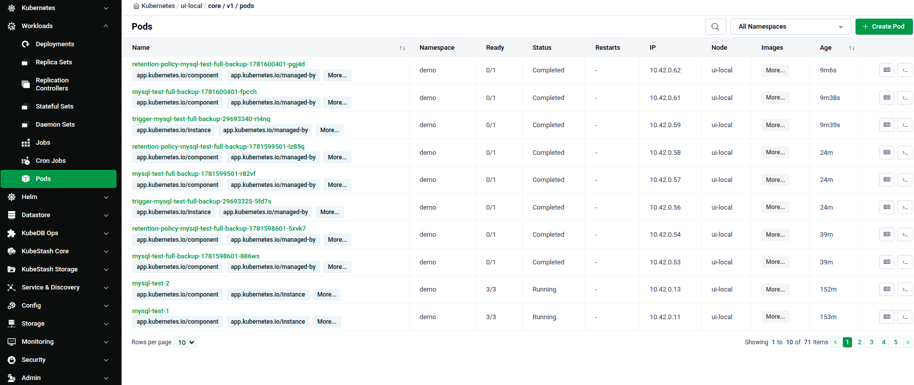
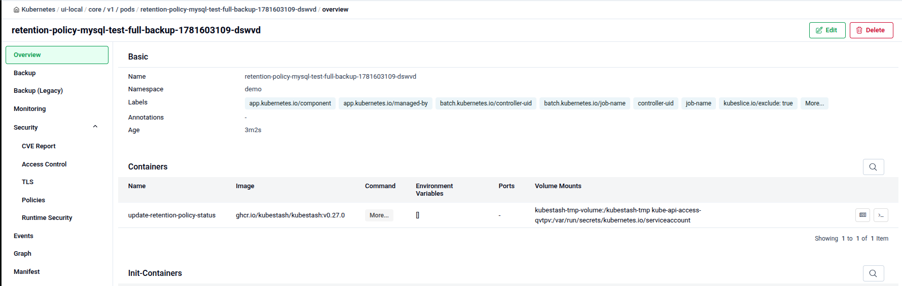
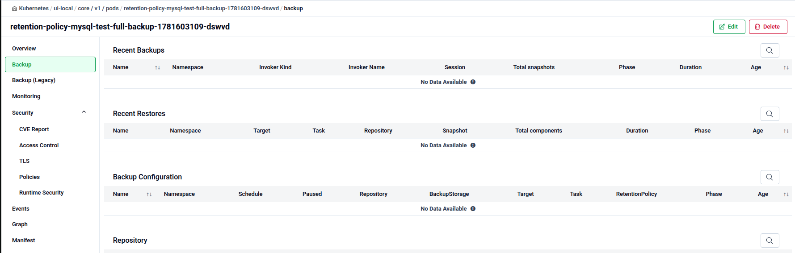
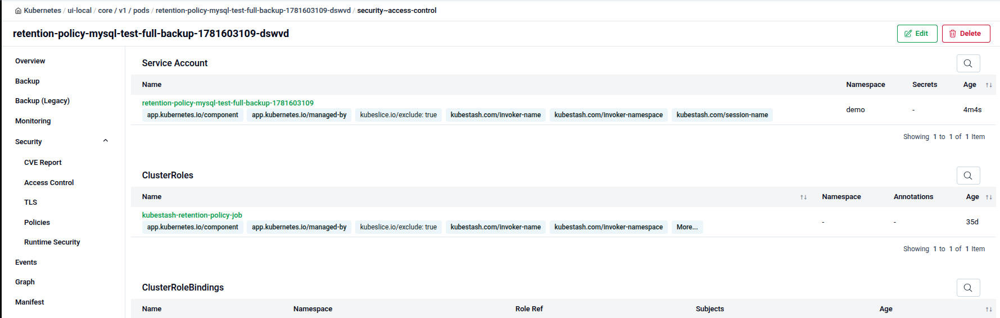
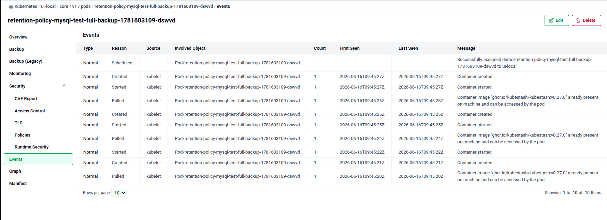
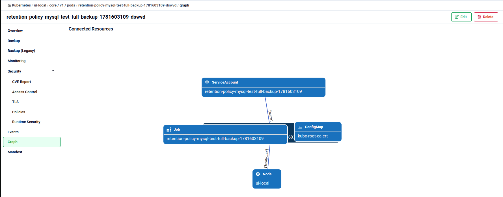
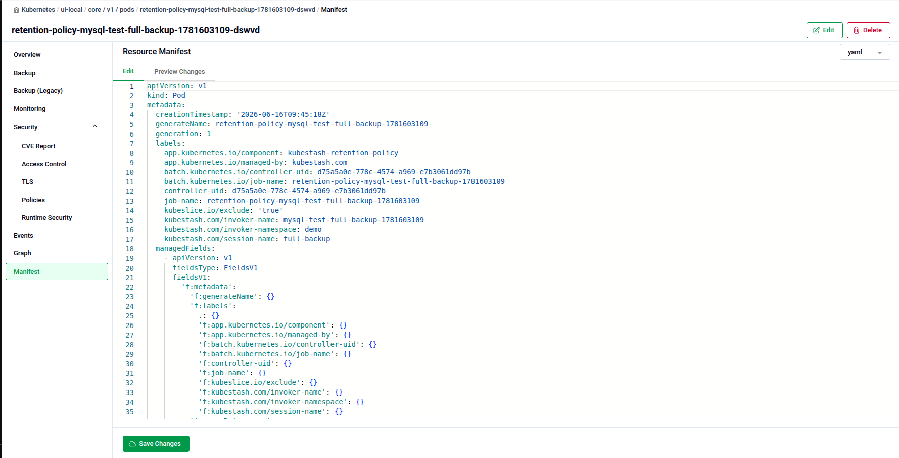

# Kubernetes Workload Management

The **Workloads** group in the Cluster UI sidebar is where you browse and manage everything that runs application containers — Deployments, Pods, Jobs, and the other standard Kubernetes workload types.

## Open the Workloads Section

1. Navigate to the [Platform Console](https://console.appscode.com).
2. Click on your imported cluster to open its Cluster Overview page.
3. In the left sidebar, click **Workloads** to expand it.

---

## Workload Resource Types

The Workloads group lists every standard Kubernetes workload kind:

- Deployments
- Replica Sets
- Replication Controllers
- Stateful Sets
- Daemon Sets
- Jobs
- Cron Jobs
- Pods

Every list page follows the same layout: a 🔍 search box, an **All Namespaces** filter dropdown, and a green **+ Create** button top-right. The table columns vary by resource — for example, Deployments show Namespace, Pods, Images, and Age.

**Pods** is the only Workloads item with extra columns — Ready, Status, Restarts, and IP — since it reflects live container state.

Click any row to open that resource's detail page — see [Viewing Workload Details](#viewing-workload-details) below.

---

## Viewing Workload Details

Click any row on a Workloads list page (e.g. a Pod) to open its **detail page**. Every detail page has the same layout: the resource name and breadcrumb at the top, **Edit** and **Delete** buttons top-right, and a set of tabs in the left panel. Which tabs appear depends on what created the resource — the example below is a Pod created by a backup Job.

### Overview Tab

The **Overview** tab shows the resource's Basic info (Name, Namespace, Labels, Annotations, Age) followed by its Containers and Init-Containers, with image, command, and volume mount details.

### Backup Tab

If the workload was created by a backup process, a **Backup** tab shows Recent Backups, Recent Restores, Backup Configuration, and the connected Repository.

### Monitoring Tab

The **Monitoring** tab lists any Service Monitors, Pod Monitors, and Prometheus instances tied to the resource, with a **+ Create** option for each.

### Security Tab

The **Security** tab group has five sub-tabs: **CVE Report** (vulnerability counts by severity), **Access Control**, **TLS** (Certificates, Issuer, ClusterIssuer, Secrets), **Policies**, and **Runtime Security**. **Access Control** shows the resource's Service Account, ClusterRoles, and ClusterRoleBindings.

### Events Tab

The **Events** tab lists the resource's Kubernetes events — Type, Reason, Source, Count, First Seen, Last Seen, and Message.

### Graph Tab

The **Graph** tab draws the resource's **Connected Resources** as a diagram — for example, a Pod linked to its ServiceAccount, ConfigMap, and Node.

### Manifest Tab

The **Manifest** tab shows the resource's raw YAML. Use **Raw** / **View Changes** to toggle the view, edit the YAML directly, and click **Save Changes** to apply.

---

## Quick Reference

| Task | How to do it |
|---|---|
| Open the Workloads view | Click your cluster on the Platform Console → click **Workloads** in the left sidebar |
| List a workload type | Click its name under the Workloads group (e.g. Deployments, Pods) |
| Filter by namespace | Use the **All Namespaces** dropdown on any list page |
| Create a new workload | Click **+ Create** on the resource's list page |
| Open a workload's details | Click its row on the list page |
| Edit a workload | Open its detail page → **Edit**, or edit directly in the **Manifest** tab |
| Delete a workload | Open its detail page → **Delete** |
| View events for a workload | Resource detail page → **Events** tab |
| View what a workload connects to | Resource detail page → **Graph** tab |
