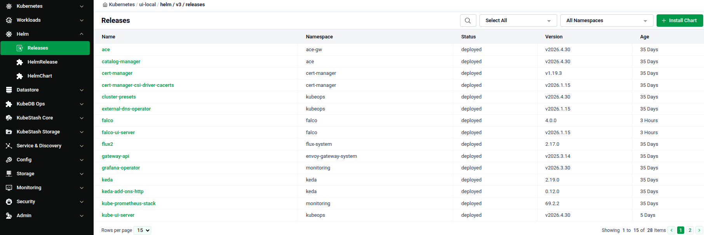
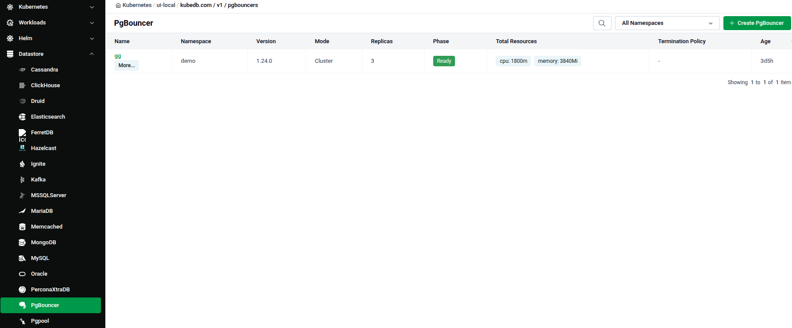
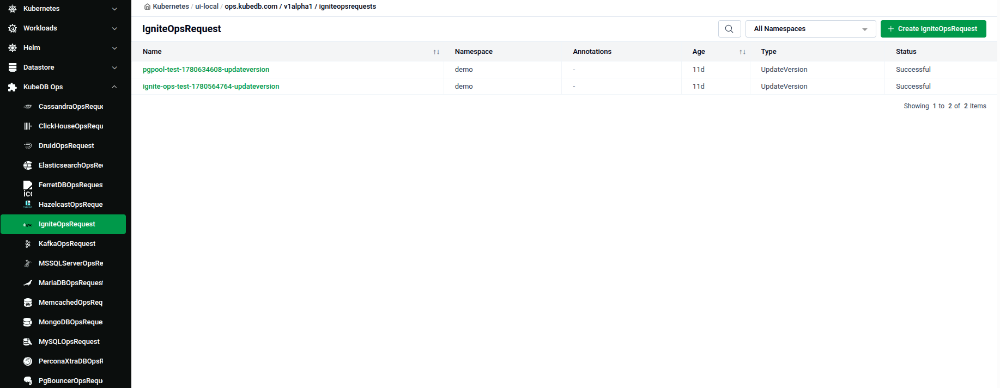
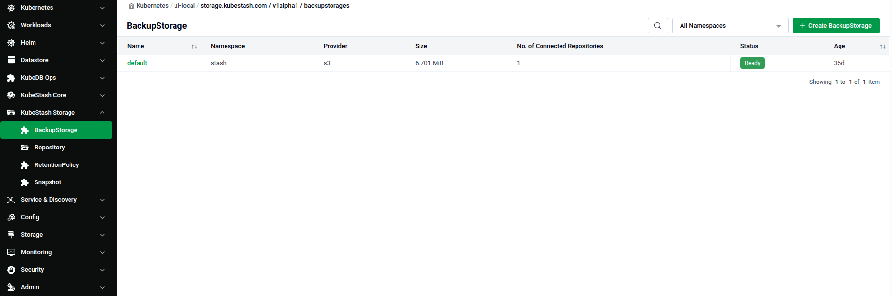
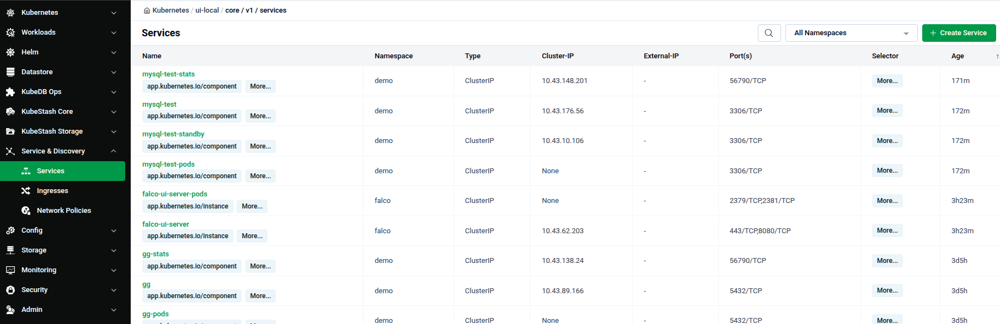
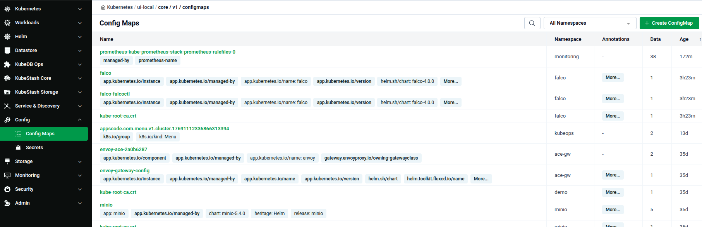
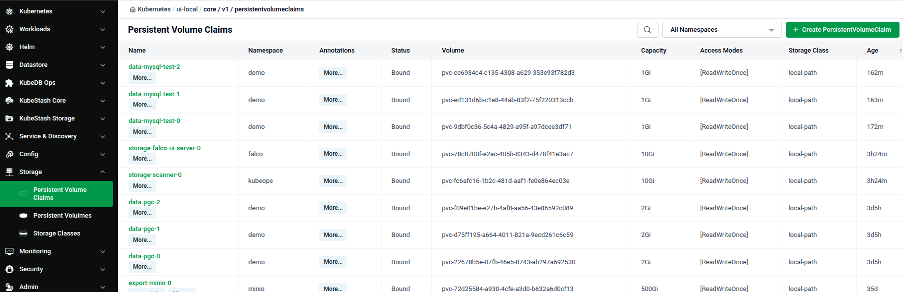
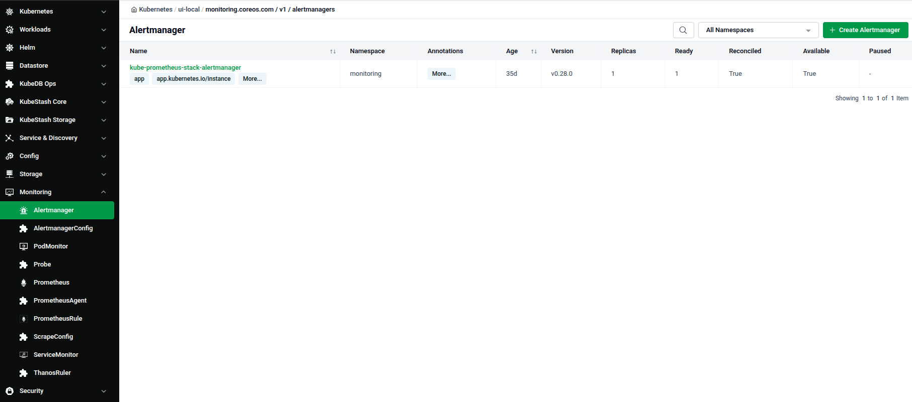
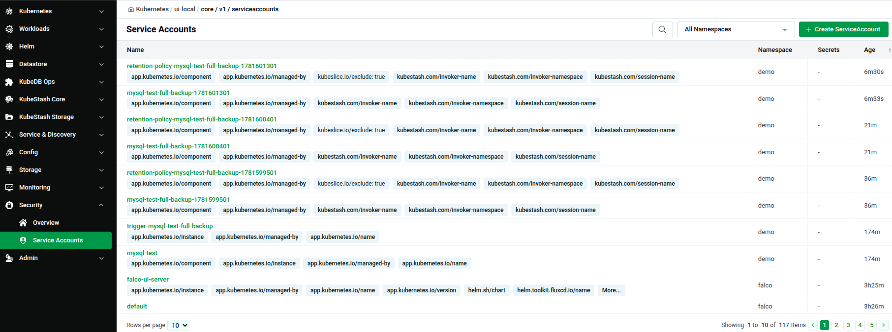
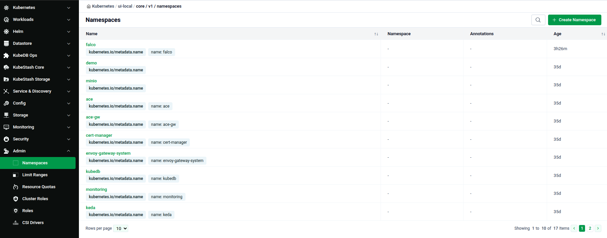

# Kubernetes Workload Management

The **Workloads** view in the Cluster UI is where you browse and manage every Kubernetes resource running inside a connected cluster — Deployments, Pods, Helm releases, databases, storage, and more — all from one screen.

1. Navigate to the [Platform Console](https://console.appscode.com).
2. Click on your imported cluster to open its **Cluster Overview** page.

---

## Cluster Overview Page

The Cluster Overview page is the landing page for a cluster. It shows the cluster's basic info, its installed Feature Sets, and the node list. See [Cluster Overview](cluster-overview.md) for a full walkthrough.

> The left sidebar described below is available on every page inside a cluster, not just Overview.

---

## Left Sidebar Navigation

The left sidebar is how you reach every resource type in the cluster. It is grouped by category — **Kubernetes**, **Workloads**, **Helm**, **Datastore**, **KubeDB Ops**, **KubeStash Core**, **KubeStash Storage**, **Service & Discovery**, **Config**, **Storage**, **Monitoring**, **Security**, and **Admin**.

> The exact groups and items you see depend on which Feature Sets are installed on the cluster. A cluster with fewer Feature Sets enabled shows fewer groups; enabling more (e.g. Databases, Backup & Recovery) adds their groups automatically. You can also customize the sidebar yourself — see [Customize the Cluster Sidebar](cluster-sidebar.md).

Click any group to expand it, then click an item to open its resource list page.

### Kubernetes

- **Overview** — the Cluster Overview page.
- **Nodes** — the cluster's node list. Covered in [Cluster Overview](cluster-overview.md).

### Workloads

The core resources for running and managing applications:

- Deployments
- Replica Sets
- Replication Controllers
- Stateful Sets
- Daemon Sets
- Jobs
- Cron Jobs
- Pods

Every list page follows the same layout: a 🔍 search box, an **All Namespaces** filter dropdown, and a green **+ Create** button top-right. The table columns vary by resource — for example, Deployments show Namespace, Pods, Images, and Age.

**Pods** is the only Workloads item with extra columns — Ready, Status, Restarts, and IP — since it reflects live container state.

Click any row to open that resource's detail page — see [Resource Management](#resource-management) below.

### Helm

- **Releases** — installed Helm releases, with Namespace, Status, Version, and Age. Use **+ Install Chart** to deploy a new one.
- **HelmRelease** — Helm-operator/GitOps style release objects, with a Ready status column.
- **HelmChart** — chart source-tracking objects, showing Source Kind, Source Name, and Status.

### Datastore

The Datastore group lists every database engine managed by KubeDB — Cassandra, ClickHouse, Druid, Elasticsearch, FerretDB, Hazelcast, Ignite, Kafka, MSSQLServer, MariaDB, Memcached, MongoDB, MySQL, Oracle, PerconaXtraDB, PgBouncer, Pgpool, and more further down the list.

Selecting an engine lists the deployed instances of that database, including its version, mode, replica count, phase, and total resources.

### KubeDB Ops

KubeDB Ops lists one **OpsRequest** type per database engine (e.g. MongoDBOpsRequest, MySQLOpsRequest, IgniteOpsRequest). An OpsRequest is how day-2 operations — version updates, restarts, scaling — are applied to an existing database instance. Each list shows the request's Type and Status (e.g. `UpdateVersion` / `Successful`).

### KubeStash Core & KubeStash Storage

These two groups cover backup and restore management:

- **KubeStash Core** — backup and restore configuration resources.
- **KubeStash Storage** — where backups are kept: **BackupStorage**, **Repository**, **RetentionPolicy**, and **Snapshot**.

The BackupStorage list shows the storage Provider (e.g. `s3`), total Size, number of connected Repositories, and Status.

### Service & Discovery

- **Services** — ClusterIP/Type, Cluster-IP, Ports, and Selector for each service.
- **Ingresses** — ingress rules for the cluster.
- **Network Policies** — traffic rules such as `allow-egress` or `allow-webhooks`.

### Config

- **Config Maps** — application configuration data, with a Data column showing key count.
- **Secrets** — credentials and certificates, with a Type column (e.g. `kubernetes.io/tls`, `Opaque`).

### Storage

- **Persistent Volume Claims** — claimed storage per workload, with Capacity, Access Modes, and Storage Class.
- **Persistent Volumes** — the underlying volumes, with Reclaim Policy and Status (`Bound`).
- **Storage Classes** — available provisioners (e.g. `local-path`).

### Monitoring

Observability resources tied to Prometheus and Alertmanager: **Alertmanager**, **AlertmanagerConfig**, **PodMonitor**, **Probe**, **Prometheus**, **PrometheusAgent**, **PrometheusRule**, **ScrapeConfig**, **ServiceMonitor**, and **ThanosRuler**.

### Security

- **Overview** — security summary for the cluster.
- **Service Accounts** — service accounts across namespaces, with their Secrets count and Age.

### Admin

Cluster-wide administrative resources: **Namespaces**, **Limit Ranges**, **Resource Quotas**, **Cluster Roles**, **Roles**, and **CSI Drivers**.

---

## Resource Management

Click any row on a list page to open that resource's **detail page**. Every detail page has the same layout: the resource name and breadcrumb at the top, **Edit** and **Delete** buttons top-right, and a set of tabs in the left panel. Which tabs appear depends on the resource kind — the example below is a Pod created by a KubeStash backup job.

### Overview Tab

The **Overview** tab shows the resource's Basic info (Name, Namespace, Labels, Annotations, Age) followed by its Containers and Init-Containers, with image, command, and volume mount details.

### Backup Tab

For KubeStash-managed resources, the **Backup** tab shows Recent Backups, Recent Restores, Backup Configuration, and the connected Repository. A **Backup (Legacy)** tab is also available alongside it for the older Stash-based backups.

### Monitoring Tab

The **Monitoring** tab lists any Service Monitors, Pod Monitors, and Prometheus instances tied to the resource, with a **+ Create** option for each.

### Security Tab

The **Security** tab group has five sub-tabs: **CVE Report** (vulnerability counts by severity), **Access Control**, **TLS** (Certificates, Issuer, ClusterIssuer, Secrets), **Policies**, and **Runtime Security**. **Access Control** shows the resource's Service Account, ClusterRoles, and ClusterRoleBindings.

### Events Tab

The **Events** tab lists the resource's Kubernetes events — Type, Reason, Source, Count, First Seen, Last Seen, and Message.

### Graph Tab

The **Graph** tab draws the resource's **Connected Resources** as a diagram — for example, a backup Job linked to its ServiceAccount, ConfigMap, and Node.

### Manifest Tab

The **Manifest** tab shows the resource's raw YAML. Use **Raw** / **View Changes** to toggle the view, edit the YAML directly, and click **Save Changes** to apply.

---

## Quick Reference

| Task | How to do it |
|---|---|
| Open the Workloads view | Click your cluster on the Platform Console → use the left sidebar |
| List a resource type | Click its group in the sidebar, then the resource name |
| Filter by namespace | Use the **All Namespaces** dropdown on any list page |
| Create a new resource | Click **+ Create** on the resource's list page |
| Open a resource's details | Click its row on the list page |
| Edit a resource | Open its detail page → **Edit**, or edit directly in the **Manifest** tab |
| Delete a resource | Open its detail page → **Delete** |
| View events for a resource | Resource detail page → **Events** tab |
| View what a resource connects to | Resource detail page → **Graph** tab |
| Customize the sidebar | See [Customize the Cluster Sidebar](cluster-sidebar.md) |
