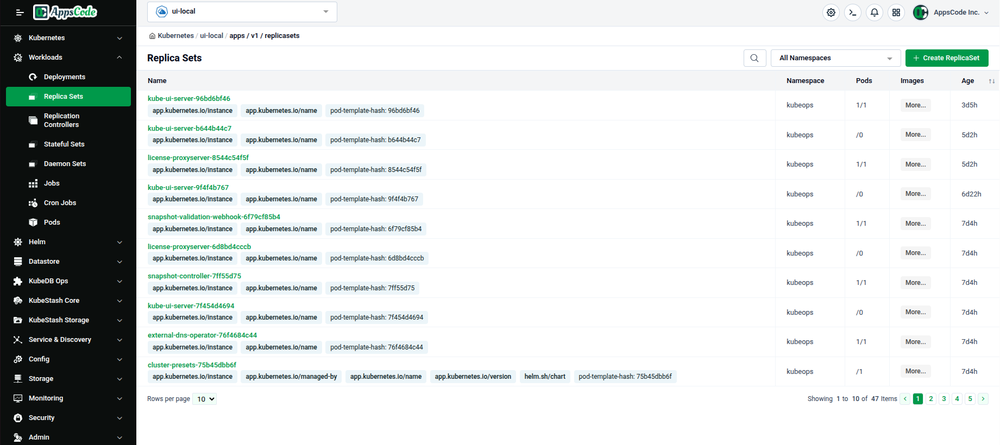
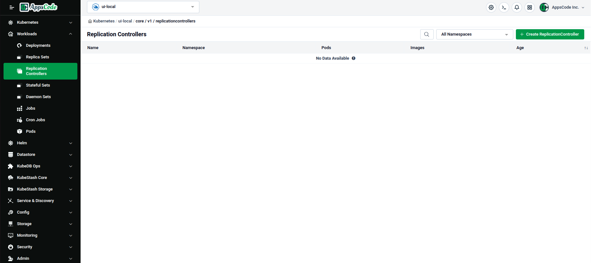
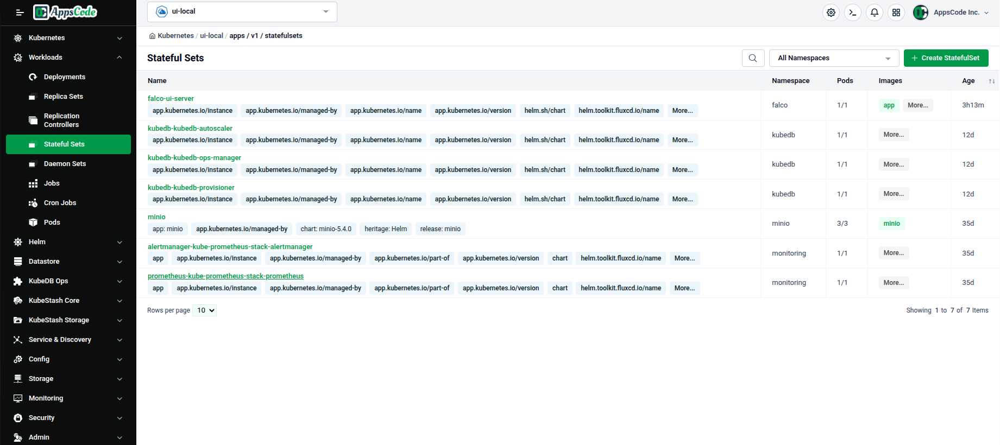
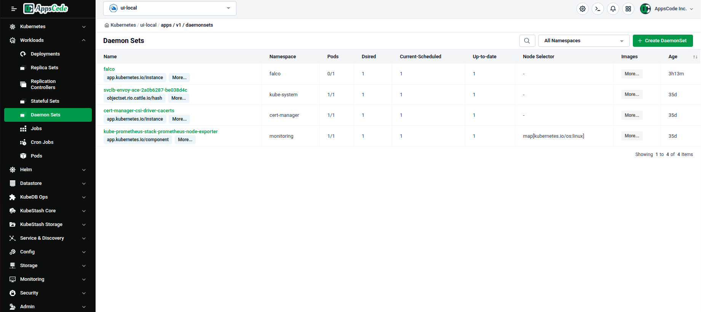
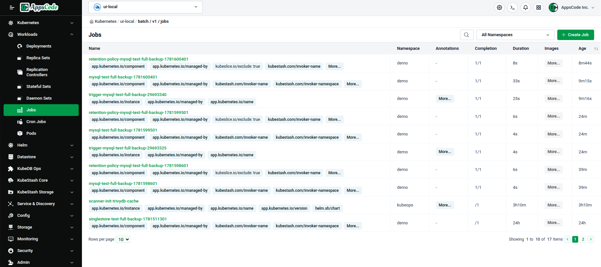
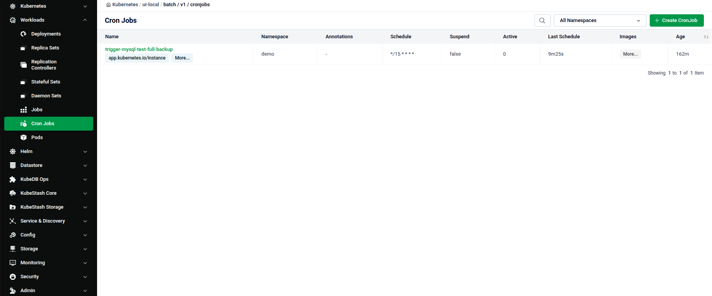

# Kubernetes Workload Management

The **Workloads** group in the Cluster UI sidebar is where you browse and manage everything that runs application containers — Deployments, Pods, Jobs, and the other standard Kubernetes workload types.

## Open the Workloads Section

1. Navigate to the [Platform Console](https://console.appscode.com).
2. Click on your imported cluster to open its Cluster Overview page.
3. In the left sidebar, click **Workloads** to expand it.

Every list page in this group follows the same layout: a 🔍 search box, an **All Namespaces** filter dropdown, and a green **+ Create** button top-right.

---

## Deployments

Lists every Deployment with its Namespace, Pods (ready count), Images, and Age.

---

## Replica Sets

Lists every Replica Set with its Namespace, Pods, Images, and Age.

---

## Replication Controllers

Lists every Replication Controller with its Namespace, Pods, Images, and Age. Click **+ Create ReplicationController** to add one.

---

## Stateful Sets

Lists every Stateful Set with its Namespace, Pods, Images, and Age.

---

## Daemon Sets

Lists every Daemon Set with its Namespace, Pods, Dsired, Current-Scheduled, Up-to-date, Node Selector, Images, and Age.

---

## Jobs

Lists every Job with its Namespace, Annotations, Completions, Duration, Images, and Age.

---

## Cron Jobs

Lists every Cron Job with its Namespace, Annotations, Schedule, Suspend, Active, Last Schedule, Images, and Age.

---

## Pods

Lists every Pod with its Namespace, Ready, Status, Restarts, IP, Images, and Age — the only Workloads item with these extra live-state columns.

---

## Quick Reference

| Task | How to do it |
|---|---|
| Open the Workloads view | Click your cluster on the Platform Console → click **Workloads** in the left sidebar |
| List a workload type | Click its name under the Workloads group (e.g. Deployments, Pods) |
| Filter by namespace | Use the **All Namespaces** dropdown on any list page |
| Create a new workload | Click **+ Create** on the resource's list page |
