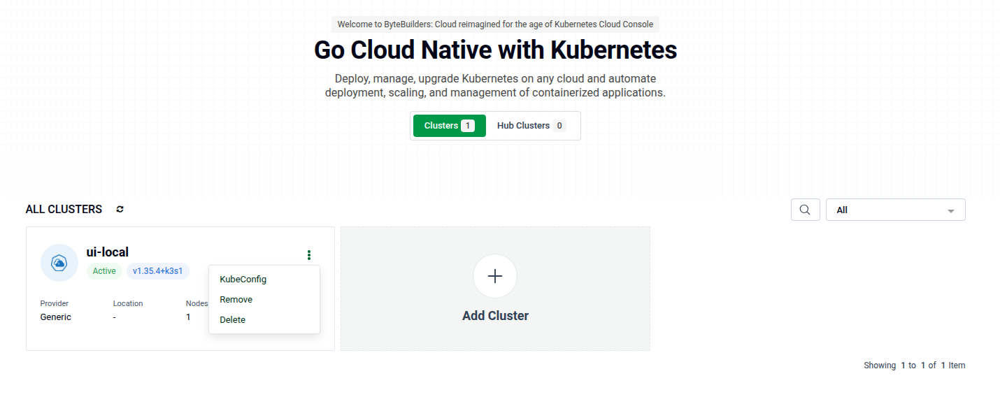

# Remove / Delete Cluster

From the cluster list, click the **⋮** (three-dot) menu on any cluster card to access removal options.

---

## Remove

**Remove** unregisters the cluster from the Platform Console. The actual Kubernetes cluster and its workloads are left untouched.

1. Go to the [Platform Console](https://console.appscode.com) cluster list.
2. Click **⋮** on your cluster card.
3. Click **Remove**.
4. In the confirmation modal, optionally check any cleanup actions you want to run before removal:
   - **Remove FluxCD** — uninstalls FluxCD from the cluster.
   - **Remove All Features** — uninstalls all ACE feature-sets from the cluster.
   - **Remove Spoke Components** — only shown if this cluster is a spoke.
5. Click **Yes, Remove** to confirm.

The console streams progress until the operation completes, then redirects you to the cluster list.

---

## Delete

**Delete** permanently destroys the cluster and its underlying infrastructure. This action is irreversible and only available for clusters provisioned via Cluster API.

1. Go to the [Platform Console](https://console.appscode.com) cluster list.
2. Click **⋮** on your cluster card.
3. Click **Delete**.
4. Confirm in the modal.

> **Warning:** Delete tears down the actual cloud infrastructure. Use Remove if you only want to unregister the cluster from the console.

---

## Quick Reference

| Action | What happens | Cluster destroyed? |
|---|---|---|
| **Remove** | Unregisters cluster from console | No |
| **Delete** | Destroys cluster + cloud infrastructure | Yes |
