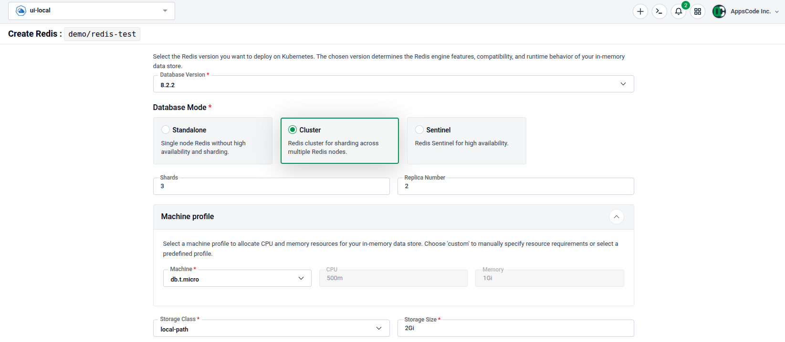

# Creating a Redis Database

This page covers the configuration specific to **Redis** — its **Database Mode** and any engine-specific settings shown below. The rest of the creation flow —
opening the wizard, namespace and name, version, machine profile, storage, and optional
features — is the same for every engine and is documented in [Common Steps](common-steps.md).

## Database Mode

Select the topology under **Database Mode**. Three modes are available:

- **Standalone** — A single-node Redis instance. Best for development or low-traffic workloads.
- **Cluster** — A sharded Redis Cluster for horizontal scaling and high availability.
- **Sentinel** — A primary/replica setup monitored by Redis Sentinel for automatic failover.

| Mode | Key fields |
|---|---|
| **Cluster** | **Master** count and **Replicas** per master. |
| **Sentinel** | **Number of Replicas** and the referenced **Sentinel** instance. |

## Create a Redis Database

1. Open the wizard and select **Redis** — see [Getting Started](common-steps.md#1-getting-started) and [Select a Database Type](common-steps.md#2-select-a-database-type).
1. Set the [namespace and name](common-steps.md#3-choose-namespace-and-name).
1. Pick the database version and the **Database Mode** described above, then set the machine profile and storage — see [Configure the Database](common-steps.md#4-configure-the-database).
1. Optionally configure [Advanced Configuration](common-steps.md#5-advanced-configuration) (labels, deletion policy, credentials, point-in-time recovery) and [Additional Options](common-steps.md#6-additional-options) (monitoring, backup, TLS, gateway).
1. Click [**Deploy**](common-steps.md#7-deploy).
