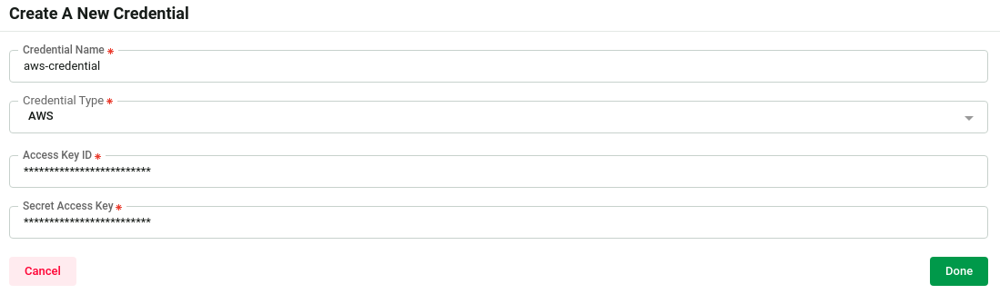
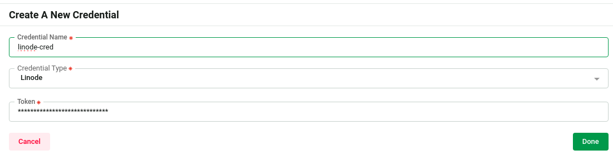

# Kubernetes Credentials Management

In order to integrate a vendor-managed Kubernetes cluster into our system, you can either opt o `Create` a new cluster or `Import` an existing one. This process involves adding specific credentials based on your vendor. <br>
Supported Credential Types include: <br>
- [AWS](#aws)
- [Azure](#azure)
- [Digital Ocean](#digital-ocean)
- [Google Cloud](#google-cloud)
- [Google OAuth](#google-oauth)
- [Linode](#linode)
- [Rancher](#rancher)

Visit https://home.appscode.com/user/settings/credentials to manage credential.


## AWS

To access EKS clusters, you need to run the following commands and provide us the generated `AccessKeyID` and `SecretAccessKey`.
- Create a policy
    ```sh
    echo '{
        "Version": "2012-10-17",
        "Statement": [
            {
                "Effect": "Allow",
                "Action": [
                    "eks:DescribeCluster",
                    "eks:ListClusters"
                ],
                "Resource": "*"
            },
            {
                "Effect": "Allow",
                "Action": "ec2:DescribeRegions",
                "Resource": "*"
            }
        ]
    }' > eks-cluster-policy.json
    ```
    ```sh
    aws iam create-policy --policy-name eks-cluster-policy --policy-document file://eks-cluster-policy.json

    POLICY_ARN=$(aws iam list-policies --query 'Policies[?PolicyName==`eks-cluster-policy`].Arn' --output text)
    ```
- Create a user and attach this policy to that user
    ```sh
    aws iam create-user --user-name "eks-cluster"
    aws iam attach-user-policy --user-name "eks-cluster" --policy-arn $POLICY_ARN
    ```
- Create Access Token for the user
    ```sh
    aws iam create-access-key --user-name "eks-cluster"
    ```

Then add the credential [here](https://home.appscode.com/user/settings/credentials/create) you got from previous step.

## Azure
## Digital Ocean
## Google Cloud
## Google OAuth
## Linode

To access LKE clusters, you need to create a API token from Linode with the following permissions.
- Kubernetes (Read/Write)

Ref: [Manage Linode Personal Access Tokens](https://www.linode.com/docs/products/tools/api/guides/manage-api-tokens/)


Then add the credential [here](https://home.appscode.com/user/settings/credentials/create) you got from Linode.


## Rancher


<!-- {
    "Version": "2012-10-17",
    "Statement": [
        {
            "Effect": "Allow",
            "Action": [
                "eks:DescribeCluster",
                "eks:ListClusters"
            ],
            "Resource": "*"
        },
        {
            "Effect": "Allow",
            "Action": "ec2:DescribeRegions",
            "Resource": "*"
        },
        {
            "Effect": "Allow",
            "Action": [
                "eks:ListUpdates",
                "eks:UpdateClusterConfig",
                "eks:UpdateClusterVersion"
            ],
            "Resource": "arn:aws:eks:*:*:cluster/*"
        }
    ]
} -->