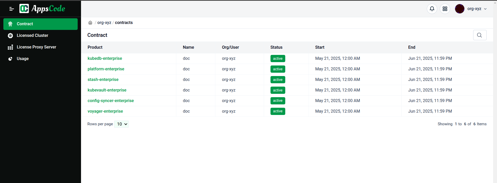

## Overview  

The AppsCode License Management System provides a comprehensive solution for managing AppsCode's product licenses across customer Kubernetes deployments. This system enables efficient license administration through a centralized billing console while ensuring secure license validation within customer environments. Supporting both `online` and `offline` licensing modes, the system accommodates various operational requirements and network constraints.

This documentation offers a detailed guide to the AppsCode License Management System, covering its architecture, operational workflows, and best practices for license administration.

In this detailed guide, we'll explore the Billing Console's functionality in depth. We'll start with an overview of its `key components`, then dive into `contract management`, explain the `license-proxyserver` deployment process, and conclude with `troubleshooting tips` for common issues. By the end, you'll have a clear, actionable understanding of how to leverage this tool to manage licenses effectively.

**Target Audience:** This guide is intended for `administrators` and `personnel` responsible for managing AppsCode's product licenses.

## AppsCode Billing Console  

A centralized web-based platform serving as the primary interface for licensing operations in the AppsCode ecosystem. Hosted on [AppsCode Billing Console](https://AppsCode.com/billing), this self-managed system allows customers to manage `contracts` by associating clusters, generating `license-proxyserver` installers and tracking clusters for which licenses are generated.

While AppsCode administrators are responsible for the core lifecycle of contracts—including their `creation`, `modification`, `revocation`, and `extension`—customers retain the ability to perform specific operations pertinent to the licensing lifecycle. This includes `associating` and `disassociating` their Kubernetes clusters with allocated contracts, generating `installers` for the `license-proxyserver` through the console, and track the `clusters` for which licenses have been issued.

### Key Components

The Billing Console serves as the central center for AppsCode's license management ecosystem. It's a web-based platform that integrates various components to provide a seamless experience. Let's break down its key elements:

- **Contracts:** Digital agreements, typically established by [AppsCode administrators](https://AppsCode.com/contact/) within the Billing Console, that define the terms of AppsCode's product (e.g., ACE, KubeDB, KubeStash, KubeVault etc.) usage. This includes the specific AppsCode products which can be licensed, the duration of the contract, applicable features, and the clusters authorized to use these licenses. Contracts ensure that usage aligns with legal and financial terms, providing a foundation for all subsequent actions in the console. Contracts can be configured for either online or offline license validation.
   
- **Licensed cluster:** The `Licensed Cluster` section within the AppsCode Billing Console offers a comprehensive overview and detailed management capabilities for Kubernetes clusters that have been issued AppsCode product licenses. This component is pivotal for administrators to monitor the cluster(s) `licences` and `events` of licensed products across their infrastructure.
   
- **License Proxy Server:** A lightweight component deployed within the customer's Kubernetes cluster(s). It functions as an on-premise license manager, acting as a bridge between AppsCode products running in the cluster and the central AppsCode Billing Console. Its primary function is to ensure that AppsCode products are properly licensed and remain compliant with the terms defined in the customer's contracts. It also handles license `validation` and `retrieval`, acting as a `gatekeeper` to ensure compliance. This localized validation mechanism enhances security and performance by keeping sensitive license checks within the customer's environment. 
   The AppsCode Billing Console generates installers for the `license-proxyserver`, customized based on the contract's mode (`online` or `offline`). Depending on the contract type (`online` or `offline`), it either periodically refreshes and validates licenses with AppsCode's central licensing servers or uses static preloaded licenses embedded during deployment for the full contract duration.

These components work together to provide a seamless experience for license administrators, allowing them to efficiently manage the entire licensing `lifecycle` from a single interface. For instance, AppsCode's administrator creates a contract for KubeDB, and associates the contract to the target customer. Then from the customer panel, the customer can add a cluster to it, generates a customized installer for the `license-proxyserver`, deploys it to the cluster, and then monitors usage—all within the Billing Console. This integrated workflow eliminates the need for disparate tools or manual processes, saving time and reducing errors.
