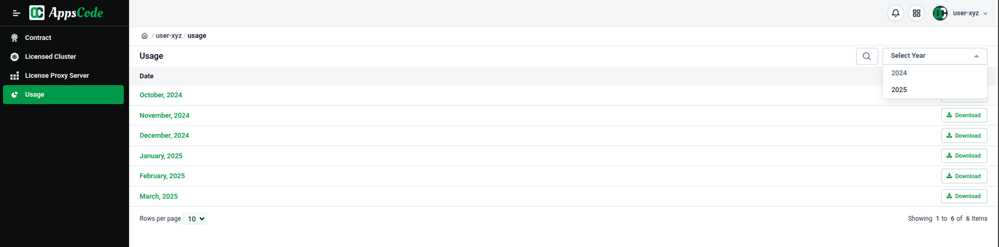
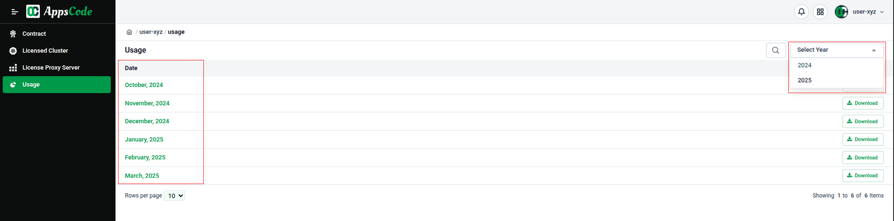
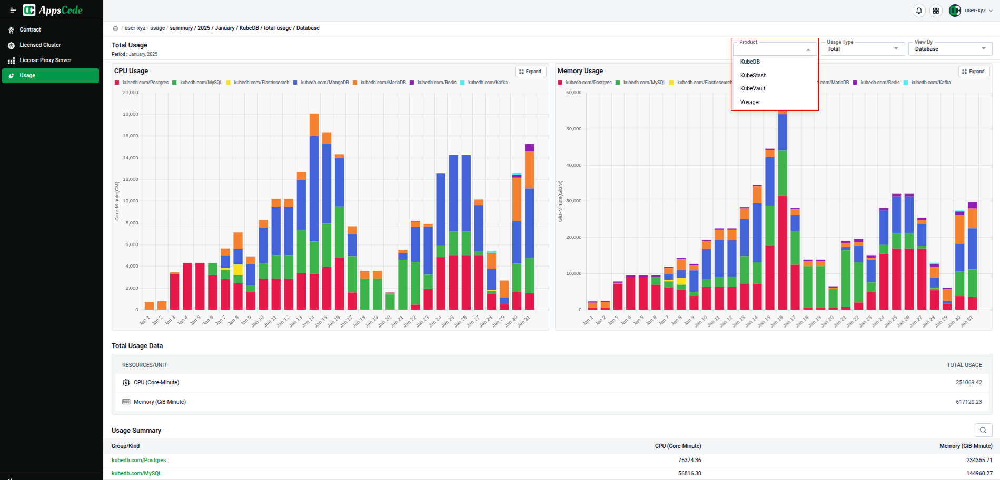
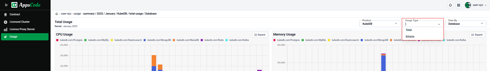
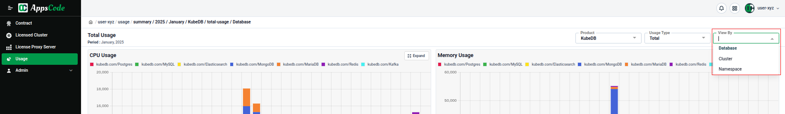
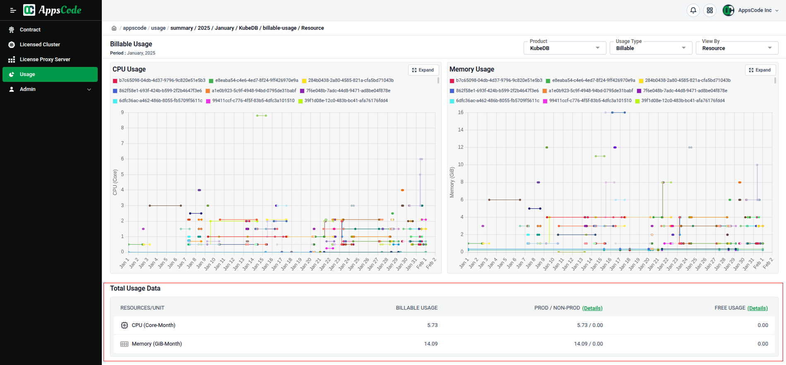
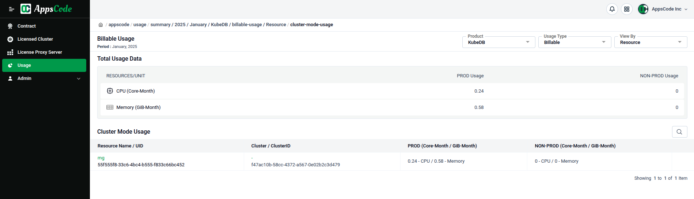

# **Billing and Usage Guide**

This document provides a detailed overview of the **Usage** section within our billing system. It explains how to navigate the user interface, monitor resource consumption, and configure **clusters** and **namespaces** for effective cost management.

## **AppsCode Billing Console — Usage**

The AppsCode Billing Console is a web-based hub at [AppsCode Billing Console](https://appscode.com/billing) where you can manage contracts, link clusters, generate license-proxyserver installers, track licensed clusters, and **monitor usage—all in one place**.

This section focuses on the **Usage** dashboard, which shows the resources consumed by downstream AppsCode services like KubeDB running in your clusters.

### **Billing View (Month, Product, Usage, View By)**

* **Month:** Our billing is month-specific. Pick the month to review and the dashboard refreshes all charts and tables to that month.

* **Product:** Use the Product dropdown to scope data to one product (KubeDB, KubeStash, Voyager, KubeVault).

* **Usage Types:**
  * **Total Usage**: total consumption for the selected scope, measured primarily in `Core-Minute` and `GiB-Minute`.
  * **Billable Usage**: the portion that is billable, measured primarily in `Core-Month` and `GiB-Month`. Billable is computed only if your organization has a paid contract for the selected product. If there’s no paid contract, a 30‑day free contract is applied and usage during this period is counted as `free usage`. See the [Contract docs](http://appscode.com/docs/en/guides/license-management/contract.html) for details.

* **View By:**
  * Choose how data is grouped. For Database view, you can drill down **Kinds → Clusters → Deployments** (for example, `kubedb.com/Postgres` → `clusters running Postgres` → `individual database deployments`).

Additional View By filters
- **View By: Cluster** — Start at clusters to see per‑cluster usage, then drill down **Clusters → Kinds → Deployments** (for example, `cluster-prod` → `kubedb.com/Postgres` → `individual postgres database deployments in cluster-prod`).
- **View By: Namespace** — Start at namespaces to see per‑namespace usage, then drill down **Namespaces → Deployments** (for example, `namespace-client-org-1` → `individual database deployments in that namespace`).

### **Billable Usage and Cost Management**

Billable shows the chargeable portion of usage for the selected month and product, reported in `Core-Month` and `GiB-Month`.

What you’ll see in the Billable table
- **Billable Usage:** total chargeable usage for the month after applying contracts and rules.
- **PROD/NON-PROD usage:** billable usage split by cluster mode—clusters marked `prod` are priced at the `PROD` rate; clusters marked `qa`, `staging`, or `dev` are priced at the `NON‑PROD` rate.

- **Free usage:** usage that isn’t billed. This includes:
  - **Trial usage** from namespaces annotated `ace.appscode.com/enable-resource-trial=true` (`first one‑month` free per database starting from its creation in that namespace).
  - Usage covered by the **30‑day free contract** when there’s no paid contract for the selected product.

**How to influence these numbers:**
  - Cluster mode (`PROD` vs `NON‑PROD`) and namespace trials are configured in Cost Management: [Cost Management](./cost-management.md)
  - Contract behavior (`paid` vs. `30‑day free` when none exists) is described here: [Contract docs](http://appscode.com/docs/en/guides/license-management/contract.html)

**For more details, please contact** [AppsCode administrators](https://appscode.com/contact/).
