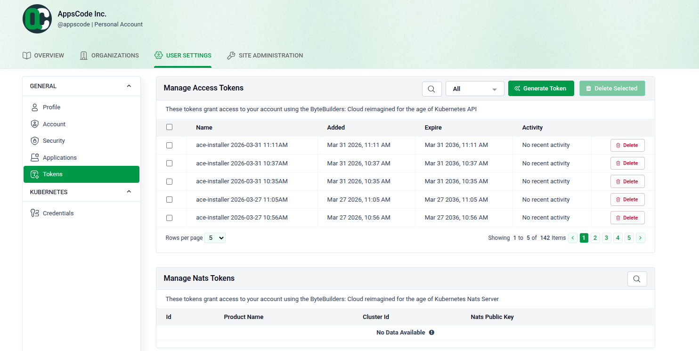
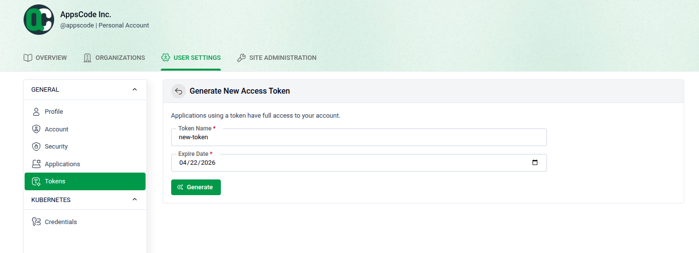
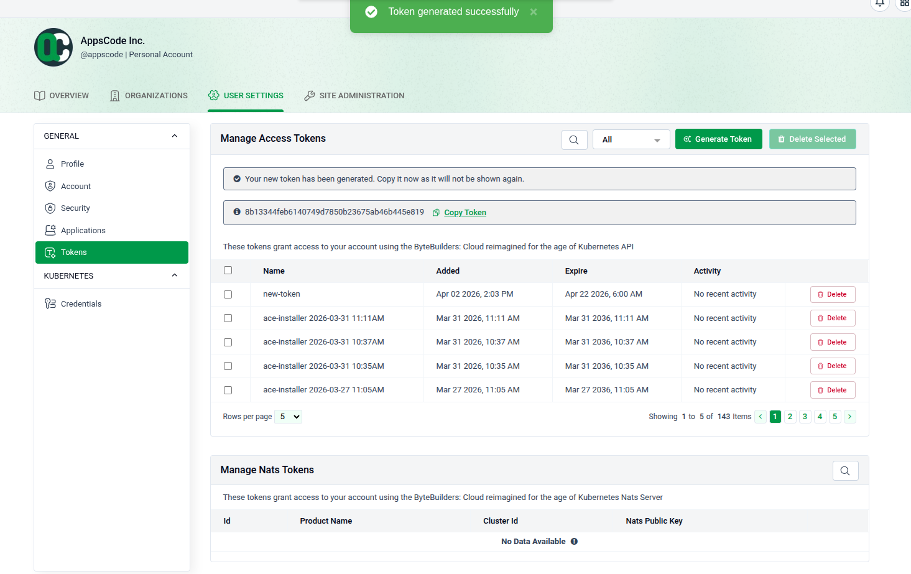

**Managing Tokens**

Manage your access and NATS tokens to securely connect external applications and services to your account.

**Access and Overview**

Go to **USER SETTINGS > Tokens** to manage your credentials.

- **Manage Access Tokens:** View existing tokens, their expiration dates, and recent activity.
- **Actions:** Use the search bar to find tokens or click **Delete** to remove them.
- **NATS Tokens:** Located at the bottom, these manage UI features and AppsCode licenses.

**Generate a New Access Token**

Click **Generate Token** to create a new credential.

- **Name:** Give your token a descriptive label.
- **Expiration:** Select an **Expire Date** using the calendar icon.
- **Generate:** Click the green **Generate** button.
- **Note:** Tokens grant full access to your account.

**Secure Your Token**

A success banner will confirm the token is created.

- ⚠️ **Copy Immediately:** Use the **Copy Token** link to save your credential now.
- **Privacy:** For security, the token string **will never be shown again** after you leave this page
