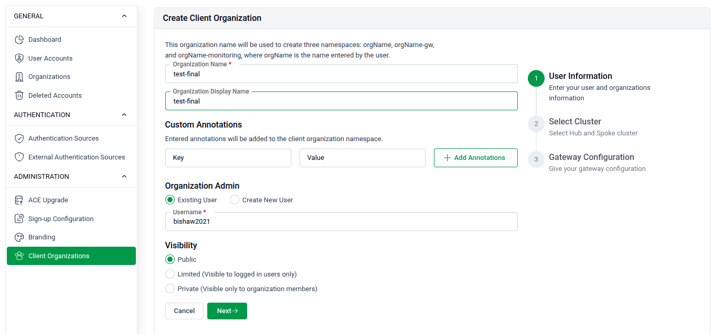
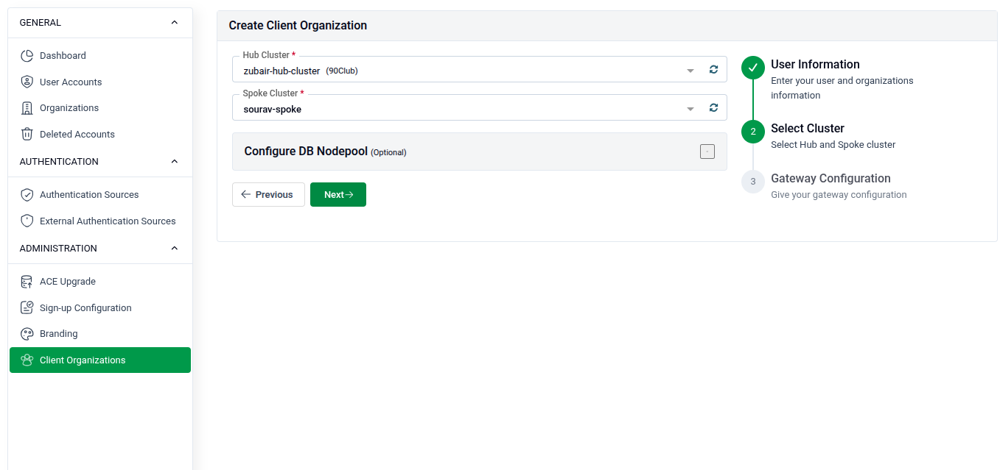
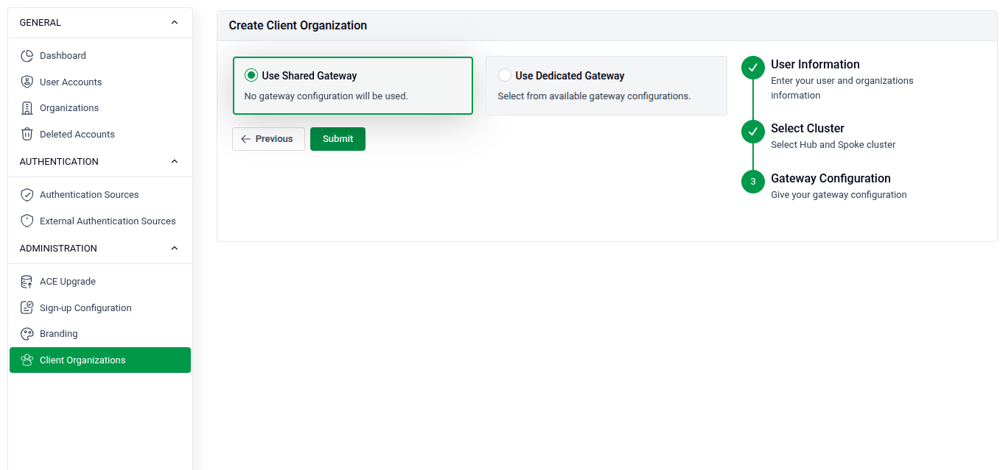
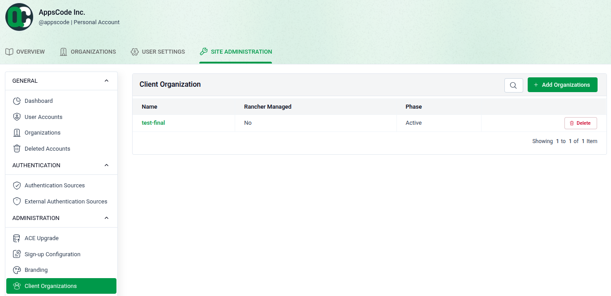
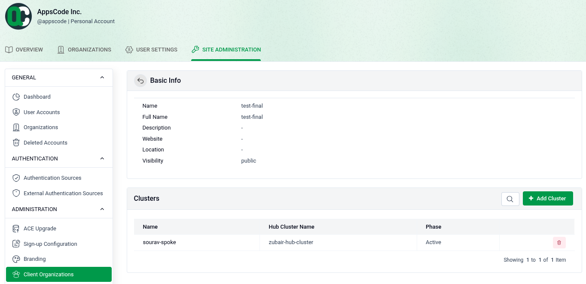

**Client Organization**

A Client Organization provides logical separation between different clients sharing the same infrastructure, ensuring that one client cannot access or create resources (like databases) belonging to another. A central administrator manages multiple environments from a Hub cluster while each client gets a dedicated Spoke cluster for their own teams, workloads, and billing.

---

**Phase 1: Setting Up the Hub & Spoke Infrastructure**

Before creating a Client Organization, you must establish a Hub-and-Spoke architecture. The Hub is the central management plane; the Spoke is where the client's workloads and databases actually run.

> **Important:** Always perform these steps from an **Organization/Work account**. Personal accounts do not support Hub-Spoke features.

**1. Create the Hub Cluster**

Import a standard Kubernetes cluster into the platform. Then:

- Navigate to the cluster's **Feature Sets** and open **Multi-cluster Hub**.
- Click **Enable**. Setup takes approximately 10–15 minutes.
- Once all status indicators turn green, the cluster is officially a Hub.

**2. Create the Spoke Cluster**

A Spoke must be a fresh cluster — you cannot repurpose an existing Hub or active Spoke.

- **Method A (During Import):** In the cluster import flow, select your Hub from the **Select Hub** dropdown.
- **Method B (After Import):** Go to the cluster's **Multi-cluster Spoke** feature set, select the Hub, and send a connection request. The Hub administrator must then go to the Hub UI and click **Accept Spoke** to finalize the link.

---

**Phase 2: Licensing the Spoke Cluster**

A Spoke cluster requires a valid license for its database and management features to function. Without it, features remain in a **Warning** state and you cannot create the organization.

**1. Get the Cluster UID**

Go to the Spoke cluster's settings in the UI and copy its unique **Cluster ID (UID)**.

**2. Generate the License**

- Visit the AppsCode license server (e.g., `license.appscode.com`).
- Navigate to the **Offline / Local Mode** section.
- Paste the Spoke Cluster UID and generate the certificate.

**3. Apply the License**

- Switch to the **Hub Cluster UI** and go to **SITE ADMINISTRATION > Licenses**.
- Click **Add License**, select the Spoke cluster, paste the generated certificate, and submit.

This enables database and management features on that Spoke.

---

**Phase 3: Creating the Client Organization**

Once your Hub is ready and your Spoke is licensed, you can create the organization.

**1. Create the Admin User**

Go to **SITE ADMINISTRATION > User Accounts** and click **Create User Account**.

- Create a dedicated user (e.g., `org1-admin`) who will own and manage this organization.

**2. Open the Add Organization Form**

Go to **USER SETTINGS > Client Organization** and click **Add Organization**.

**Step 1 — Basic Info**

- **Organization Name:** Use lowercase letters and hyphens (e.g., `guide-org-01`).
- **Organization Admin:** Assign the admin user you just created (e.g., `org1-admin`).

**Step 2 — Cluster & Node Pool**

- Select your **Hub** and **Spoke** clusters.
- In the **Node Pool** section, add **Labels** and **Tolerations** to enforce physical isolation:
  - Labels example: `org=1`
  - Toleration example: Key: `dedicated`, Value: `org1`, Effect: `NoSchedule`

This ensures the client's databases only run on their assigned nodes.

**Step 3 — Gateway Configuration**

- Set **Host Type** to **Domain** and provide a hostname (e.g., `org1.kubedb.cloud`).
- Set the **Service Type** to **LoadBalancer**.
- **DNS Setup:** After the load balancer is provisioned by your cloud provider (e.g., AWS ELB), copy its DNS name and create a **CNAME record** in your DNS provider (e.g., Cloudflare) pointing your hostname to that DNS.

---

**Phase 4: Verification**

After clicking **Submit**, the system automatically creates three dedicated namespaces: one for the organization, one for the gateway, and one for monitoring.

When `org1-admin` logs in, they will only see these namespaces and their assigned Spoke cluster — fully isolated from other clients on the Hub. They can then create databases, manage their own team members, and track usage independently.
