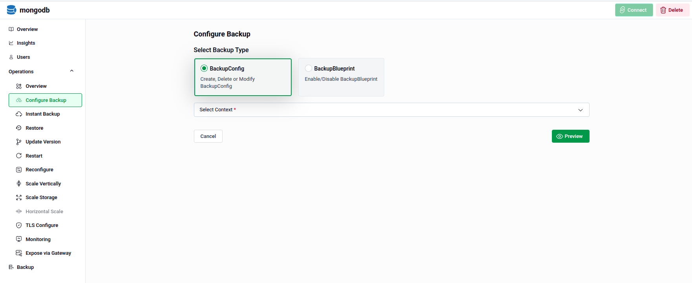
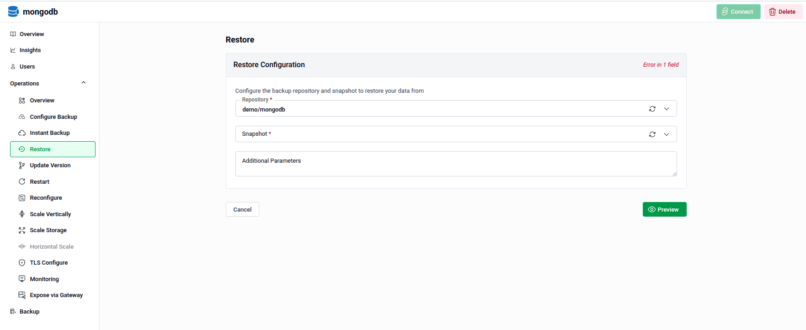
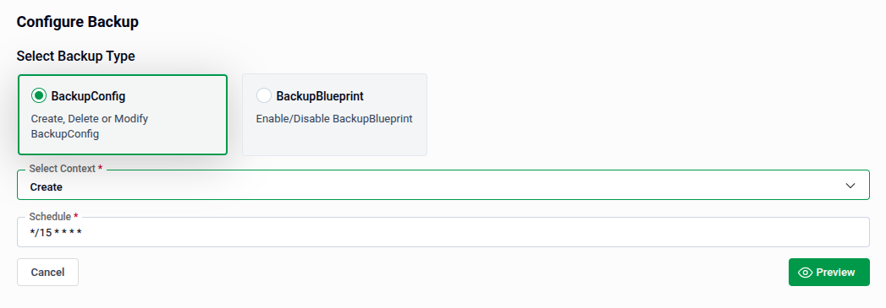
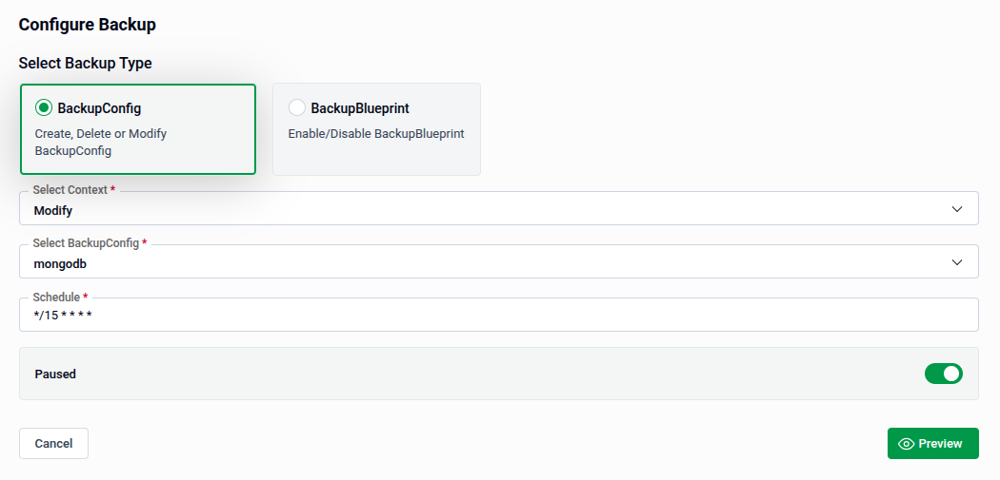
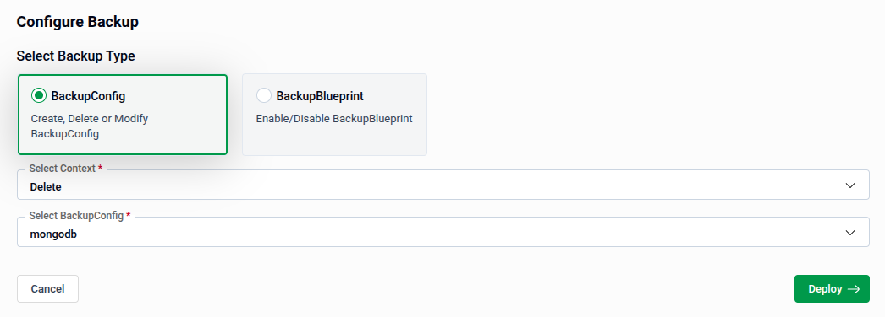
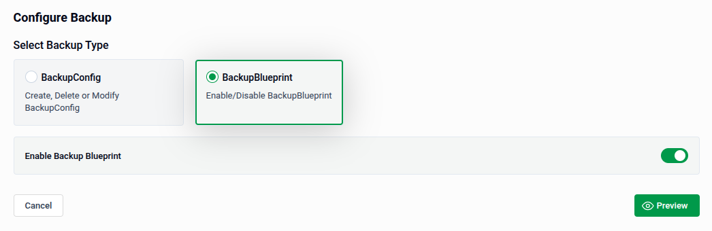
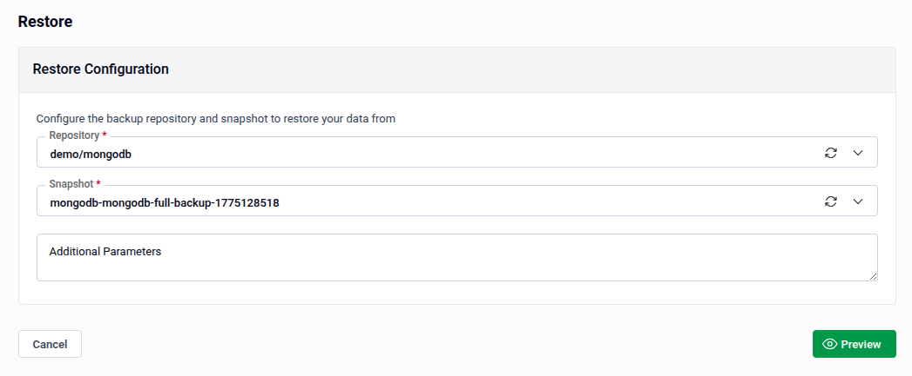

# Configure Backups & Restore

This guide provides instructions for using the **Configure Backup** interface to manage data protection for your systems. The interface allows you to handle individual backup configurations (**BackupConfig**) or broader templates (**BackupBlueprint**). Also this provides instructions for using the **Restore** interface to recover data from a specific backup snapshot.

## **Section 1: Getting Started**
To begin, you must select the **Configure Backup** or **Restore** from left sidebar. This selection determines the available settings and workflow.

- **BackupConfig:** Use this to create, delete, or modify specific backup tasks. 
- **BackupBlueprint:** Use this to manage high-level templates for enabling or disabling backups across multiple resources.

- **Restore:** Use this to recover data from a specific backup snapshot.

## **Section 2: Managing Backup Configurations (BackupConfig)**
When **BackupConfig** is selected, you must define the **Select Context** to indicate the specific action you wish to perform.

### **2.1 Creating a New Configuration**
Use this context to set up a new automated backup schedule.

1. **Select Context:** Choose **Create** from the dropdown menu. 
1. **Schedule:** Enter a cron expression to define the backup frequency. For example, entering \*/15 \* \* \* \* will trigger the backup every 15 minutes. 
   1. **Tip:** Ensure your cron expression is accurate, as this field is mandatory (marked with a red asterisk). 
1. **Finalize:** Click **Preview** to review your settings before saving. 

### **2.2 Modifying an Existing Configuration**
Use this context to update the settings or status of an active backup.

1. **Select Context:** Choose **Modify**. 
1. **Select BackupConfig:** Pick the specific configuration you want to edit (e.g., "mongodb") from the dropdown list. 
1. **Update Schedule:** You can change the cron expression if the backup needs to run more or less frequently. 
1. **Paused Toggle:** Use this switch to temporarily stop the schedule without deleting the configuration. 
   - The backup is paused (inactive) if whitch is on. Otherwise, the backup is active and will run according to the schedule. 
1. **Finalize:** Click **Preview** to see how the changes will impact your system. 

### **2.3 Deleting a Configuration**
Use this context to permanently remove a backup configuration.

1. **Select Context:** Choose **Delete**. 
1. **Select BackupConfig:** Select the configuration profile you wish to remove (e.g., "mongodb"). 
1. **Finalize:** Click **Deploy** to execute the deletion. 
   - **Warning:** Unlike other contexts, this button says **Deploy**, indicating that clicking it will immediately apply the removal. 

## **Section 3: Managing Backup Blueprints (BackupBlueprint)**
Selecting the **BackupBlueprint** type allows you to toggle predefined backup templates for your environment.

1. **Enable Backup Blueprint Toggle:** 
   - Switching on activates the selected blueprint, applying its settings to the relevant resources. Otherwise, this deactivates the blueprint. 
1. **Finalize:** Click **Preview** to confirm which configurations will be affected by this change before it takes effect. 

**User Guide: Restore Configuration**

This guide provides instructions for using the **Restore** interface to recover data from a specific backup snapshot. You can access this section under the **Operations** menu in the sidebar.

## **Section 4: Configuring the Restore**

The **Restore Configuration** form allows you to define exactly which data you want to recover and where it should come from.

1. **Repository:** Select the backup repository that contains your data (e.g., **demo/mongodb**).

2. **Select Snapshot:** Choose the specific point-in-time backup you wish to restore.

3. **Additional Parameters:** Provide any specific configuration flags or advanced parameters.

- **Important Consideration:** Red star marked field is required to proceed. If left empty, the system will display an "Error in 1 field" warning.
